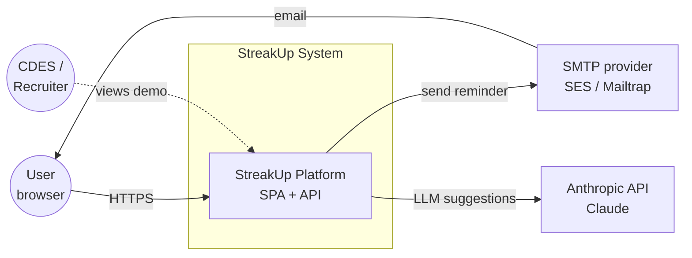
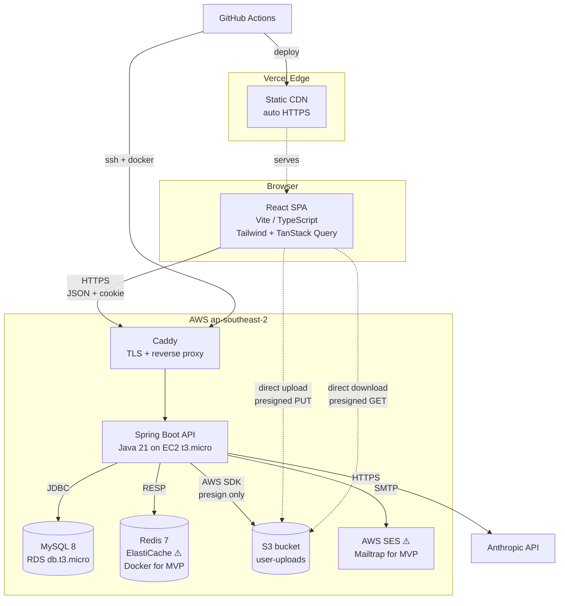
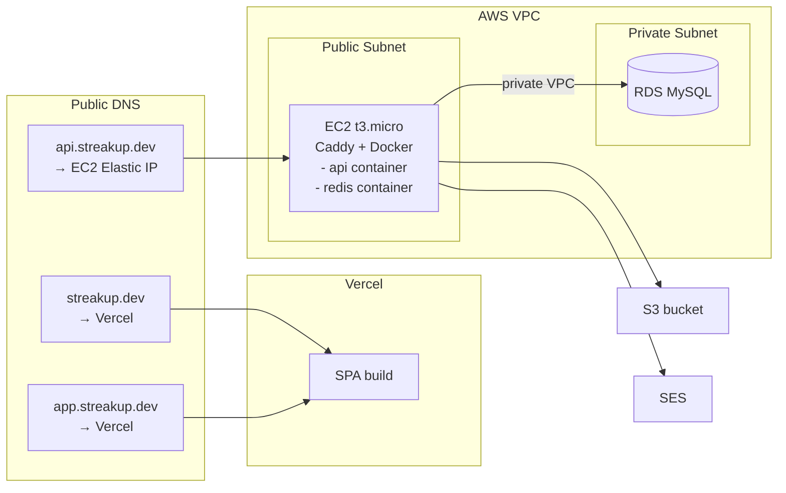
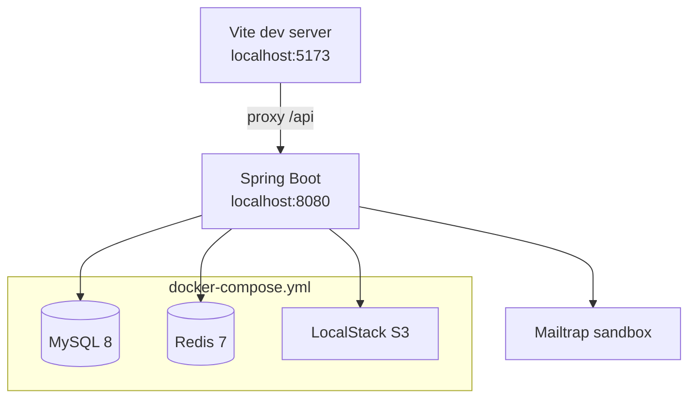
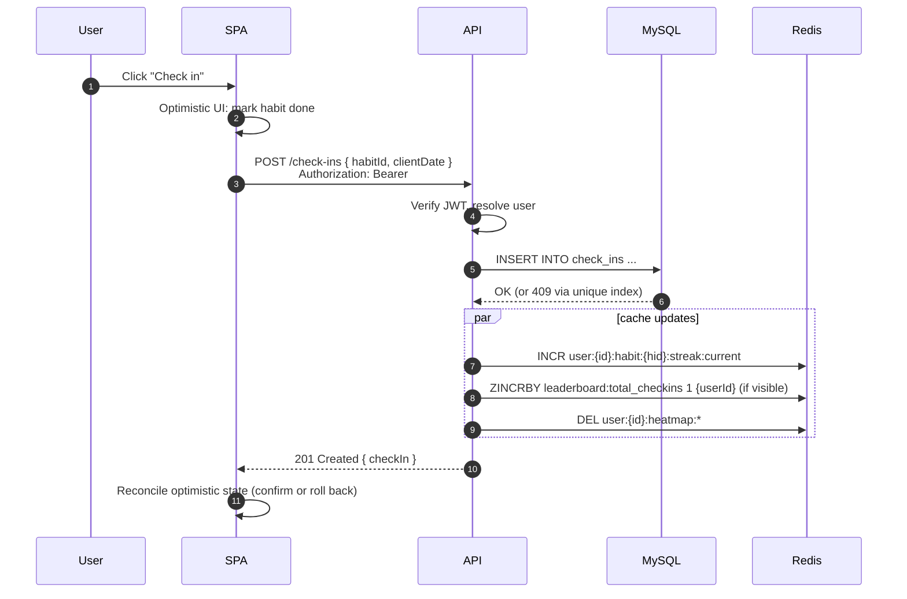
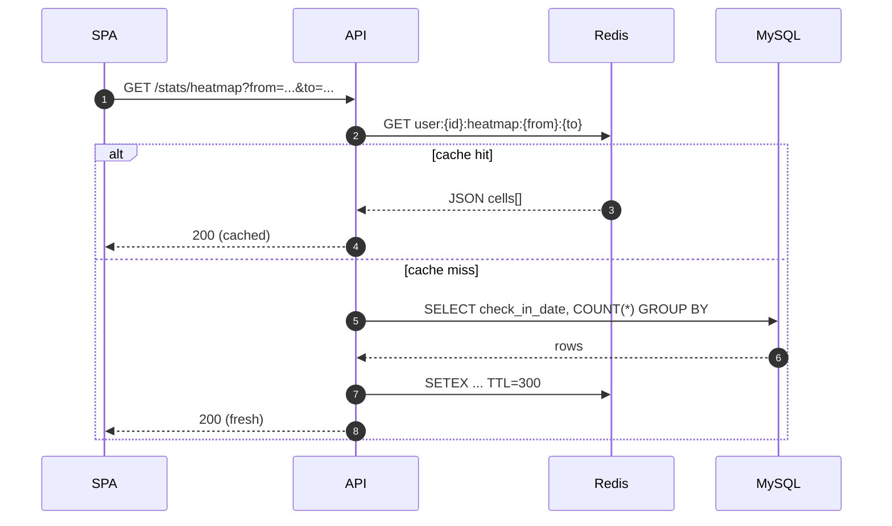
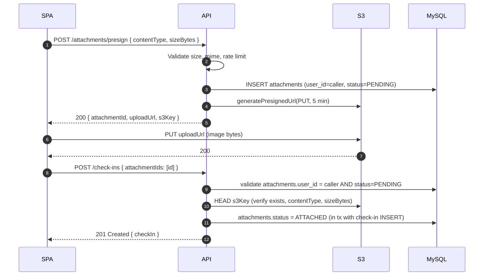

# StreakUp — System Architecture

> **Audience**: interviewers, future contributors, future-me.
> **Scope**: production topology (live demo target) + local dev topology + request paths for the three most interesting flows.
> **Status**: target architecture as of Day 2. Marked ⚠️ where the component is provisioned later than Day 10 (i.e., mocked or deferred in early phases).

---

## C4 — Context (Level 1)



- **Primary actor**: end-user via browser.
- **Secondary actor**: recruiters viewing the live demo. Design decisions are influenced by the "recruiter 30-second scan" requirement for the README and demo presentation.
- **External systems**: SMTP for reminders (Day 28), Anthropic for optional LLM features (Day 29). Both are behind feature flags so the core loop works if either is down.

---

## C4 — Container (Level 2)



### Container responsibilities

| Container | Tech | Role | Notes |
|---|---|---|---|
| **SPA** | React 18, Vite, TS | All UI, client-side routing, optimistic updates | Ships as static assets; no SSR. |
| **Vercel Edge** | Vercel | Global CDN + auto HTTPS for the SPA | Previews on every PR. |
| **Caddy** | Caddy 2 | Reverse proxy, auto Let's Encrypt cert | Runs in the same EC2 VM as the API, next to Docker. |
| **API** | Spring Boot 3.4, Java 21 | REST API, auth, business logic, scheduled jobs | Single deployable JAR in a Docker container. Single instance in MVP; ShedLock already present so horizontal scaling is a 1-line change. |
| **MySQL** | RDS MySQL 8 | System of record | Single-AZ db.t3.micro (free tier). Flyway migrations run on app boot. |
| **Redis** | ElastiCache Redis 7 ⚠️ | Streaks, heatmap cache, leaderboard ZSET, rate-limit counters, ShedLock | MVP runs Redis in a Docker sidecar on the same EC2 — ElastiCache is the production target once we have users. |
| **S3** | S3 bucket | Attachment storage | Bucket policy denies all; access only via presigned URLs minted by the API. |
| **SES** | AWS SES ⚠️ | Daily reminder emails | Starts as Mailtrap sandbox during Day 28 development; promoted to SES after domain verification. |
| **Anthropic** | Claude API | LLM-backed suggestions (Day 29) | Called server-side only; API key never leaves the backend. |

---

## Deployment Topology

### Production (Day 33 onward)



- **Single-region**: `ap-southeast-2` (Sydney) — closest free-tier region to Auckland.
- **Split-origin production**: the SPA is served from `streakup.dev` / `app.streakup.dev`, while the API lives at `api.streakup.dev`. Cross-origin requests with an explicit CORS allowlist and `credentials: include` are part of the intended design.
- **VPC isolation**: RDS is only reachable from the EC2 security group. No public DB endpoint.
- **Secrets**: injected via SSM Parameter Store at container boot. Nothing committed to the repo.
- **Cost ceiling**: designed to fit entirely in AWS free tier + ~$1 USD/month for the domain. Vercel free plan covers the SPA.

### Local development



- `docker-compose up` yields a fully-working stack without touching any AWS account.
- LocalStack emulates S3, so presigned-URL code paths are exercised identically in dev and prod.
- Vite proxies `/api/*` to `localhost:8080` in dev for convenience, but production intentionally stays split-origin (`app` / `streakup.dev` -> `api.streakup.dev`) with explicit CORS and credentialed refresh requests.
- Redis TLS is disabled for local dev and the MVP EC2 sidecar. Flip `REDIS_SSL_ENABLED=true` only when Redis moves to ElastiCache with in-transit encryption.

---

## Backend Package Layout

```
com.streakup
├── auth/           JWT, refresh-token logic, AuthController, AuthService
├── user/           profile endpoints, User entity
├── habit/          Habit CRUD
├── checkin/        CheckIn CRUD, CheckInSpecification (dynamic query)
├── tag/            Tag + CheckInTag
├── attachment/     S3 presign + Attachment entity
├── stats/          heatmap, streaks, monthly completion, leaderboard
├── security/       SecurityConfig, JwtFilter, AccessService (ownership checks)
├── common/
│   ├── error/      ApiErrorResponse, GlobalExceptionHandler, domain exceptions
│   ├── persistence/ BaseEntity, AuditingConfig
│   ├── redis/      RedisTemplate config, key builders
│   └── time/       TimezoneResolver, Clock bean
├── scheduler/      ReminderJob, RefreshTokenCleanupJob (ShedLock-guarded)
└── StreakupApplication.java
```

**Convention**: every feature is a *vertical slice* — its own package with entity / repo / service / controller / DTO together. Cross-cutting infrastructure lives under `common` and `security`. This keeps PR diffs focused and makes the code easy to delete if a feature gets cut.

---

## Frontend Directory Layout

```
src/
├── views/          route-level components (DashboardView, HabitDetailView, ...)
├── components/     reusable UI (HabitCard, Heatmap, StreakBadge, ...)
├── api/            typed axios modules (auth.ts, habits.ts, checkins.ts)
│   └── client.ts   axios instance + interceptors (refresh queue lives here)
├── stores/         Zustand stores (authStore, uiStore)
├── hooks/          useHabit, useCheckInMutation, useHeatmapQuery
├── lib/            formatters, date utils (timezone), validators
├── types/          shared TS types (or generated from OpenAPI)
├── router.tsx      React Router v6 routes + guards
└── main.tsx
```

- **State separation** (pattern, not rule): Zustand for *client state* (auth, UI prefs), TanStack Query for *server state* (habits, check-ins). Mixing both is what makes React codebases rot.
- All API calls go through `api/client.ts` — the refresh-token retry queue and base URL live there and only there.

---

## Key Request Flows

### 1. Daily Check-In (happy path)



- Writes are **synchronous to MySQL** (source of truth), cache updates are fire-and-forget. If Redis fails, the check-in still succeeds; the next read rebuilds the cache from DB.
- Heatmap and streaks can be recomputed from `check_ins` on any cache miss, so drift is self-healing. The leaderboard deliberately counts all retained check-ins from users who have `leaderboardVisible = true`, including history from archived habits, so the canonical rebuild query is `SELECT c.user_id, COUNT(*) FROM check_ins c JOIN users u ON u.id = c.user_id WHERE u.leaderboard_visible = true GROUP BY c.user_id`. A missed `ZINCRBY` stays missed until a `LeaderboardReconcileJob` (ShedLock-guarded, nightly) `ZADD`-replaces the whole key. Drift ceiling ≤ 24h, acceptable for a top-10 board.
- The client-local day is transported via `clientDate`; server validates it against its UTC `Clock` bean projected into the user's saved timezone (`users.timezone`). If the user travels, the client must update `/users/me.timezone` before writing date-bound data.

### 2. Heatmap Render



- TTL = 5 min. This is "eventual consistency with a cheap ceiling" — heatmap doesn't need real-time accuracy, and the write-side also invalidates (`DEL user:{id}:heatmap:*`), so cache rarely shows stale data in practice.

### 3. Attachment Upload



- **The backend never proxies the file bytes.** This is the single biggest reason we can run the API on a t3.micro without tipping over.
- **Pending attachments are still user-owned.** The presign flow stores `attachments.user_id` immediately, so later `attachmentIds` can be ownership-checked before attach and cannot be hijacked by another caller.
- **Upload confirmation is attach-time metadata verification.** The API uses `HEAD Object` to confirm the file was actually uploaded and still matches the declared `contentType` / `sizeBytes`; no extra "complete upload" endpoint is needed.
- PENDING attachments unattached for > 1 hour are purged by `AttachmentCleanupJob` (ShedLock-guarded).

---

## Cross-Cutting Decisions

### Timezone strategy

The app has exactly one rule: **"a day" is defined by the user's saved IANA timezone in `users.timezone`.** Server computes the calendar date; DB stores `check_in_date DATE`. There is no request-time timezone override for writes, which keeps streaks, duplicate prevention, and leaderboard eligibility anchored to one authoritative value. Users who travel update their profile timezone first. No offsets, no fractional zones, no DST math in controllers — all timezone logic lives in `common.time.TimezoneResolver` and is unit-tested against `Pacific/Auckland` (DST) and `Asia/Shanghai` (no DST).

### Auth model

See [auth-flow.md](auth-flow.md) for the full sequence. One-line summary: **access JWT in memory, refresh token in `HttpOnly` cookie, server-side hash-compare + rotation + lineage-based theft detection.**

### Observability

- **Logs**: Logback JSON in prod, human-readable in dev. Every request line carries `traceId` + `userId`.
- **Metrics**: Micrometer → `/actuator/prometheus` (not publicly exposed in MVP). Key metrics: `http.server.requests`, `jdbc.connections.active`, `cache.hit.ratio` by key prefix.
- **Uptime**: UptimeRobot pings `/actuator/health` every 5 min. Slack webhook on red.
- **Errors**: stdout only in MVP. Sentry integration is a v2 item (out of 6-week scope).

### Security posture

| Threat | Mitigation |
|---|---|
| XSS exfiltrating the access token | Access token in JS memory only; refresh token `HttpOnly` so malicious JS can't read it |
| CSRF against refresh endpoint | `SameSite=Lax` cookie + cookie scoped to `/api/v1/auth` + refresh endpoint requires no body |
| SQL injection | JPA/Specification only; no string-concat SQL anywhere |
| Password cracking on DB leak | BCrypt with work factor 12 |
| Refresh token theft | SHA-256 hash in DB + one-time-use rotation + reuse-triggered chain revocation |
| S3 bucket enumeration | Deny-all bucket policy; all access via time-bounded presigned URLs |
| Credential stuffing on `/auth/login` | IP-based rate limit (5 / 15 min) |
| Email enumeration on login | Generic 401 message regardless of which field is wrong |

### Scaling runway

Single EC2 + single RDS handles low-thousand DAU comfortably. First bottleneck would be MySQL connection count — addressed by HikariCP pool sizing (default 10, plenty for one node). Beyond that: RDS vertical bump → ElastiCache replacing in-container Redis → ECS with N stateless API tasks fronted by an ALB (the ShedLock foundation means none of the scheduled jobs double-fire during that transition).

This runway is **documented, not built**. MVP ships the single-node topology.

---

## What This Architecture Deliberately Does Not Include

| Thing | Why not |
|---|---|
| Microservices | One team, one deployable, one week of backend work. Modular monolith fits the honest scope. |
| Event bus / Kafka | No downstream consumer exists in MVP. Redis invalidation is enough. |
| Service mesh | One service. |
| OAuth / SSO | Email/password demonstrates auth depth for the JD; OAuth is 2 days I don't have. |
| CQRS / event sourcing | No audit-heavy regulatory requirement; add if justified by a future feature. |
| Self-hosted Grafana | UptimeRobot + `/actuator/metrics` is the right ceiling for a 6-week resume project. |

These omissions are *design decisions* — the answer to "why didn't you do X?" is "X costs more than the marginal reviewer/user value in a 6-week window". Each deferred capability has a conceivable trigger for re-opening it.
