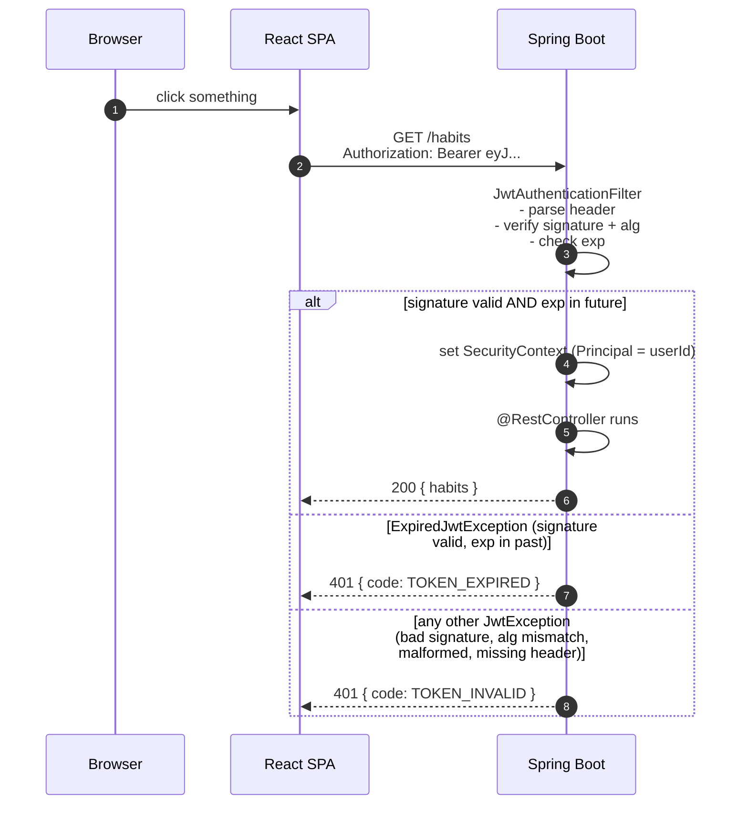
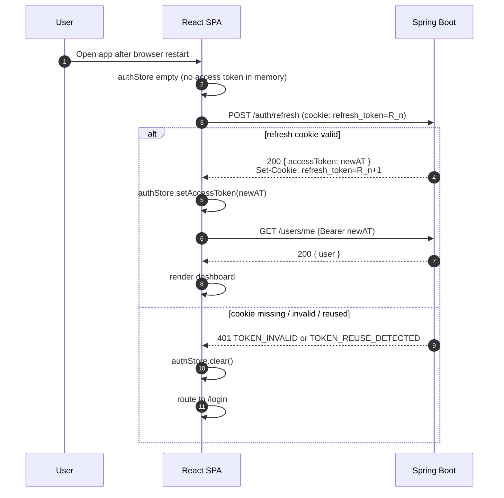
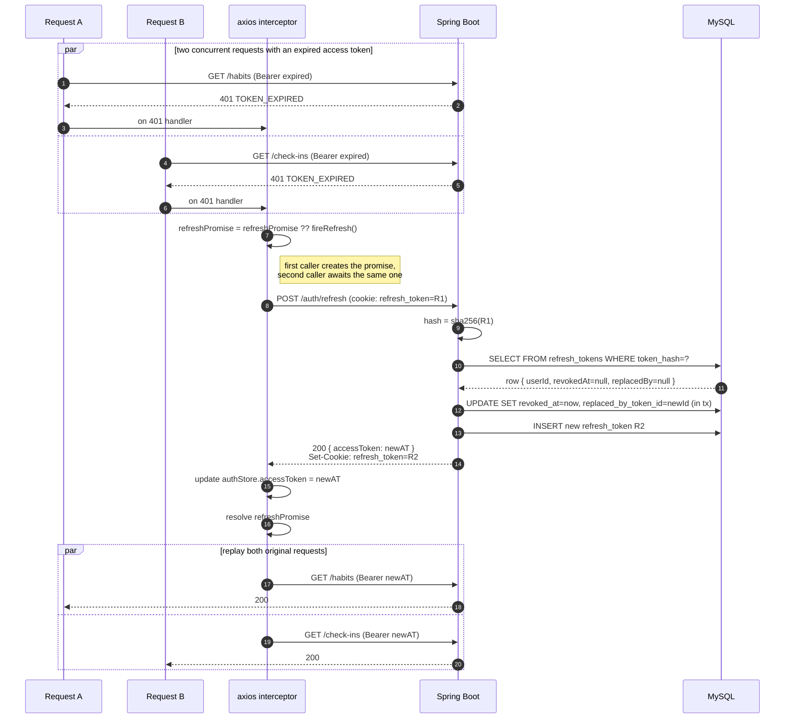
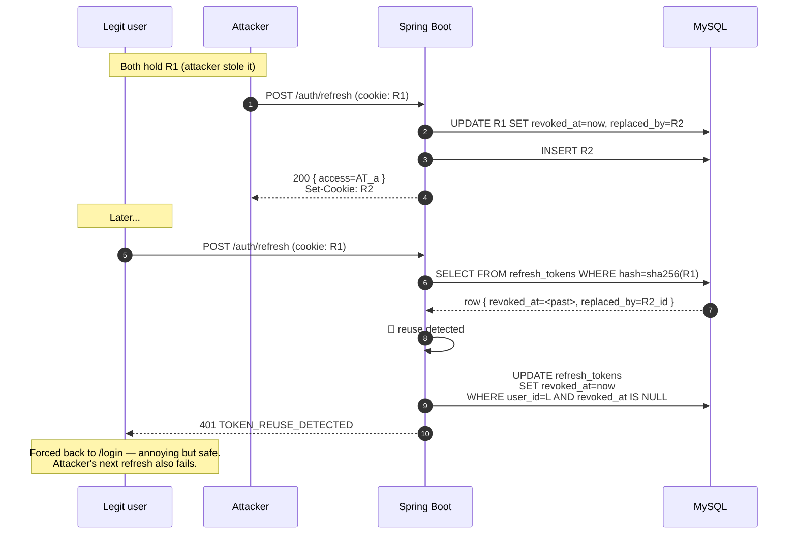
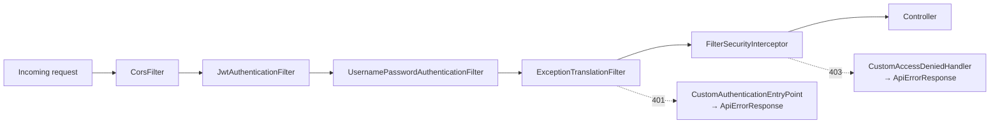

# StreakUp — Authentication Flow

> **Why this document exists as a standalone file**: JWT + refresh-token rotation is the single highest-frequency interview topic on this project. Having a dedicated diagram + narrative — separate from the broader architecture — means I can walk an interviewer through the threat model and the code paths without flipping between pages.

---

## Token Model at a Glance

| Token | Format | Lifetime | Storage (client) | Storage (server) | Sent as |
|---|---|---|---|---|---|
| **Access token** | JWT (HS256) | 15 min | JavaScript memory (Zustand `authStore`) | not stored — validated by signature + expiry | `Authorization: Bearer` header |
| **Refresh token** | opaque random (32 bytes base64url) | 30 days | `HttpOnly` cookie | SHA-256 hash in `refresh_tokens` table | `Cookie: refresh_token=...` on `/api/v1/auth/*` |

### Why two tokens

- **Short-lived access token** means a stolen token has a narrow exploitation window (≤ 15 min).
- **Long-lived refresh token** means the user is not forced to log in every 15 min — the SPA silently rotates in the background.
- **Separation of concerns**: the access token is cheap to verify (signature check, no DB hit) and stateless; the refresh token is expensive (DB lookup, rotation write) but used rarely.

### Why these storage choices

| Option | Chosen? | Rationale |
|---|---|---|
| Access token in `localStorage` | ❌ | Any XSS exfiltrates it for 15 min of wide-open access. |
| Access token in `HttpOnly` cookie | ❌ | We'd still need a CSRF mitigation; and the SPA needs the token to add `Authorization` headers for cross-origin requests. |
| **Access token in memory** | ✅ | XSS can read it *while the page is open* — but the token expires in 15 min, and page reload drops it. Paired with a short TTL, the exposure is bounded. |
| Refresh token in `localStorage` | ❌ | XSS catastrophe: 30-day credential leak. |
| **Refresh token in `HttpOnly` cookie** | ✅ | Inaccessible to JS. `SameSite=Lax` kills the cross-site CSRF vector. Path-scoped to `/api/v1/auth` so it's not sent on every API call. |

---

## Flow 1: Register → First Token Pair

```mermaid
sequenceDiagram
    autonumber
    participant U as Browser
    participant API as Spring Boot
    participant DB as MySQL

    U->>API: POST /auth/register { email, password, displayName, timezone }
    API->>API: Validate (email format, min 8 chars, upper/lower/digit, IANA zone)
    API->>DB: SELECT id FROM users WHERE email=?
    alt exists
        DB-->>API: row
        API-->>U: 409 EMAIL_TAKEN
    else not exists
        API->>API: bcryptHash(password)
        API->>DB: INSERT INTO users (...)
        API->>API: issueTokenPair(userId)
        Note right of API: access = JWT<br/>refresh = random32Bytes<br/>store SHA-256(refresh) in DB
        API->>DB: INSERT INTO refresh_tokens (hash, user_id, expires_at, device_fingerprint)
        API-->>U: 201 { accessToken, user }<br/>Set-Cookie: refresh_token=...; HttpOnly; Secure; SameSite=Lax; Path=/api/v1/auth
    end
```

### `AuthService.issueTokenPair` (logical pseudocode)

```
function issueTokenPair(userId):
    accessToken = jwt.sign({ sub: userId, type: "access" }, secret, exp: now+15min)
    refreshRaw  = base64url(secureRandom(32))                    // returned to client
    refreshHash = sha256(refreshRaw)                              // stored in DB
    refreshTokens.insert(
        userId,
        tokenHash = refreshHash,
        expiresAt = now + 30 days,
        deviceFingerprint = sha256(userAgent + ipOctets[0..2])
    )
    return (accessToken, refreshRaw)
```

**Why SHA-256 not BCrypt** for the refresh hash: the refresh token is a high-entropy random string (256 bits). BCrypt's slow-hash property is irrelevant when there's no dictionary risk — it would just add latency to a very hot path. SHA-256 is the right tool (see `/docs/decisions/0002-refresh-token-hashing.md`).

---

## Flow 2: Access Token — Normal API Call



Two distinct 401 codes by design — the SPA's interceptor branches on them:
- `TOKEN_EXPIRED` → run the silent-refresh queue, then replay the original request transparently.
- `TOKEN_INVALID` → clear auth state and redirect to `/login`. Don't attempt refresh: a malformed or forged token is not something a refresh cycle can rescue.

Mapping in `JwtAuthenticationFilter`: catch `ExpiredJwtException` first (subclass of `JwtException`) → emit `TOKEN_EXPIRED`; any other `JwtException` / `IllegalArgumentException` → emit `TOKEN_INVALID`. Both codes are defined in [error-codes.md](error-codes.md).

No DB hit on the hot path — that's the whole point of JWT for access tokens. The filter class is `security.JwtAuthenticationFilter`, registered once in `SecurityConfig` before `UsernamePasswordAuthenticationFilter`.

---

## Flow 3: Browser Restart → Session Restore

The subtle part of this design is that **the access token intentionally dies on reload** because it only lives in memory. "Stay logged in after a browser restart" therefore means "the refresh cookie can mint a fresh access token during app bootstrap".



This bootstrap call is why `US-02`'s "session survives browser restart" still holds even though the access token never touches `localStorage`.

---

## Flow 4: Silent Refresh (the interesting one)

This is the flow I'll be asked to draw on a whiteboard. It has three interleaving concerns:

1. **Axios response interceptor** retries the original request after refreshing.
2. **Refresh-request de-duplication** so N concurrent requests that all hit a 401 trigger exactly **one** `/auth/refresh` call.
3. **Token rotation**: the old refresh token is invalidated, a new one issued.



### Frontend interceptor logic (pseudocode)

```ts
// src/api/client.ts
let refreshPromise: Promise<string> | null = null

axios.interceptors.response.use(
  r => r,
  async error => {
    const original = error.config
    if (error.response?.status !== 401 || original._retried) throw error
    original._retried = true

    refreshPromise ??= axios.post('/auth/refresh')
      .then(r => { authStore.setAccessToken(r.data.accessToken); return r.data.accessToken })
      .catch(e => { authStore.logout(); router.push('/login'); throw e })
      .finally(() => { refreshPromise = null })

    const newToken = await refreshPromise
    original.headers.Authorization = `Bearer ${newToken}`
    return axios(original)
  }
)
```

The single-flight pattern is critical. Without it, a dashboard that fires five queries in parallel would trigger five rotations — each invalidating the previous, and four of them would fail reuse detection and **log the user out**.

---

## Flow 5: Refresh Token Theft Detection

The highest-value property of this whole scheme. If an attacker steals a refresh token (e.g., via a browser extension compromise), they will at some point use it. So will the legitimate user. We detect this because **rotation makes each refresh token single-use**.



The chain tracked by `replaced_by_token_id` exists specifically for this case — it tells the detection code "this was a valid token, someone is replaying it after rotation, so treat it as compromised".

---

## Flow 6: Logout

```mermaid
sequenceDiagram
    participant SPA
    participant API
    participant DB as MySQL

    SPA->>API: POST /auth/logout (cookie: R_n)
    API->>DB: UPDATE refresh_tokens SET revoked_at=now WHERE token_hash=?
    API-->>SPA: 204<br/>Set-Cookie: refresh_token=; Max-Age=0
    SPA->>SPA: authStore.clear() + drop in-memory accessToken
    SPA->>SPA: navigate to /login
```

Logging out revokes **only the current session** (one refresh token). A "log out everywhere" feature would `UPDATE ... WHERE user_id=? AND revoked_at IS NULL` — out of MVP scope but trivial on this schema.

---

## Cookie Attributes — The Exact Line

```
Set-Cookie: refresh_token=<opaque>;
            HttpOnly;
            Secure;
            SameSite=Lax;
            Path=/api/v1/auth;
            Max-Age=2592000
```

| Attribute | Why |
|---|---|
| `HttpOnly` | JavaScript cannot read the cookie — XSS cannot exfiltrate the refresh token. |
| `Secure` | Cookie only sent over HTTPS. Set conditionally: off in dev (`localhost`), on in every other profile. |
| `SameSite=Lax` | Prevents CSRF from third-party sites. `Lax` (not `Strict`) because top-level navigation after password reset emails shouldn't drop the session. We're not using the cookie for anything triggered by cross-site form POSTs. |
| `Path=/api/v1/auth` | Cookie is *only* sent on the three auth endpoints. No accidental exposure to every API request. |
| `Max-Age=2592000` | 30 days. Matches `refresh_tokens.expires_at`. |

The cookie is **not** `Domain=`-scoped — it's host-only for `api.streakup.dev`, which means the SPA on `app.streakup.dev` can't see the cookie even though they share an apex. The SPA invokes `/auth/refresh` via cross-origin fetch with `credentials: 'include'`, which works because CORS is configured `Allow-Credentials: true` for that specific origin.

In the same split-origin deployment, `POST /auth/register`, `POST /auth/login`, and `POST /auth/logout` must also be sent with `credentials: 'include'` / `withCredentials: true`. Those endpoints set or clear the same refresh cookie, and browsers otherwise ignore cross-origin `Set-Cookie` headers even when the JSON response itself succeeds.

---

## Backend Request Filter Chain



- **`JwtAuthenticationFilter`** is a `OncePerRequestFilter` registered *before* `UsernamePasswordAuthenticationFilter`. It parses the bearer token, validates it, and populates `SecurityContextHolder`. No session.
- **`CustomAuthenticationEntryPoint`** serialises the `ApiErrorResponse` shape for 401s — without it Spring Security emits a plain text "Unauthorized" which breaks the client's error handler.
- **`CustomAccessDeniedHandler`** does the same for 403s emitted from method-level security.
- `/auth/login`, `/auth/register`, `/auth/refresh`, `/swagger-ui/**`, `/v3/api-docs/**`, and `/actuator/health` are explicitly `permitAll`. Everything else `authenticated`.

---

## Threat Model Summary

| Threat | Without this design | With this design |
|---|---|---|
| XSS on SPA | Drains access + refresh tokens → full takeover | Reads short-lived access token (≤ 15 min exposure); cannot reach refresh cookie |
| CSRF against write endpoints | Forged `POST /check-ins` | Access token required in Authorization header; browsers don't auto-send headers cross-site; refresh cookie `SameSite=Lax` + path-scoped |
| Stolen refresh token | 30 days of impersonation | Detected on first double-use; all tokens revoked, user re-auths |
| DB dump | Attacker replays tokens | Tokens are SHA-256 hashed; raw values never stored |
| Brute-force login | Free credential stuffing | Rate-limited (5 / IP / 15 min); generic 401 prevents email enumeration |
| JWT algorithm confusion | "alg: none" bypass | `SignatureAlgorithm.HS256` hard-coded; parser rejects other algs |
| Long-lived sessions leaking | Stolen laptop = forever access | 30-day refresh max; "logout everywhere" available on schema (post-MVP) |

---

## Interview Talking Points (for future me)

These are the questions I expect and the crisp answers:

| Question | Answer shape |
|---|---|
| *"Why not put both tokens in cookies?"* | Access token needs to be readable by JS to set `Authorization` on cross-origin calls. Two different storage tiers for two different risk profiles. |
| *"Why rotate refresh tokens?"* | Without rotation, a leaked refresh token is valid for its full 30 days and there's no way to detect it. Rotation turns every refresh into a single-use operation; reuse is the signal. |
| *"Why hash refresh tokens with SHA-256 instead of BCrypt?"* | BCrypt's slow-hash property defends against dictionaries. A 256-bit random token has no dictionary. BCrypt just adds latency to a hot path. |
| *"How does the SPA avoid N parallel refresh calls?"* | Single-flight pattern in the axios interceptor: a module-level `refreshPromise` ref; second 401 awaits the same promise. |
| *"What happens to in-flight requests during a rotation?"* | 401'd once → queued on `refreshPromise` → retried with the new token via `original._retried` guard. |
| *"Why `SameSite=Lax` and not `Strict`?"* | `Strict` breaks legitimate cross-site entry points like password-reset email links. `Lax` still kills the CSRF vector for POST without top-level navigation, which is what we actually care about. |
| *"What if Redis is down when we try to rate-limit login?"* | Fail-open on the counter, log a WARN. The security property degrades (no rate limit) but the service stays up; login attempts still need correct credentials. |

---

## References

- Schema definitions: [er-diagram.md](er-diagram.md#refresh_tokens)
- API endpoints: [api-spec.md](api-spec.md#auth)
- ADR: `/docs/decisions/0002-refresh-token-hashing.md`
- ADR: `/docs/decisions/0007-jwt-algorithm-choice.md`
