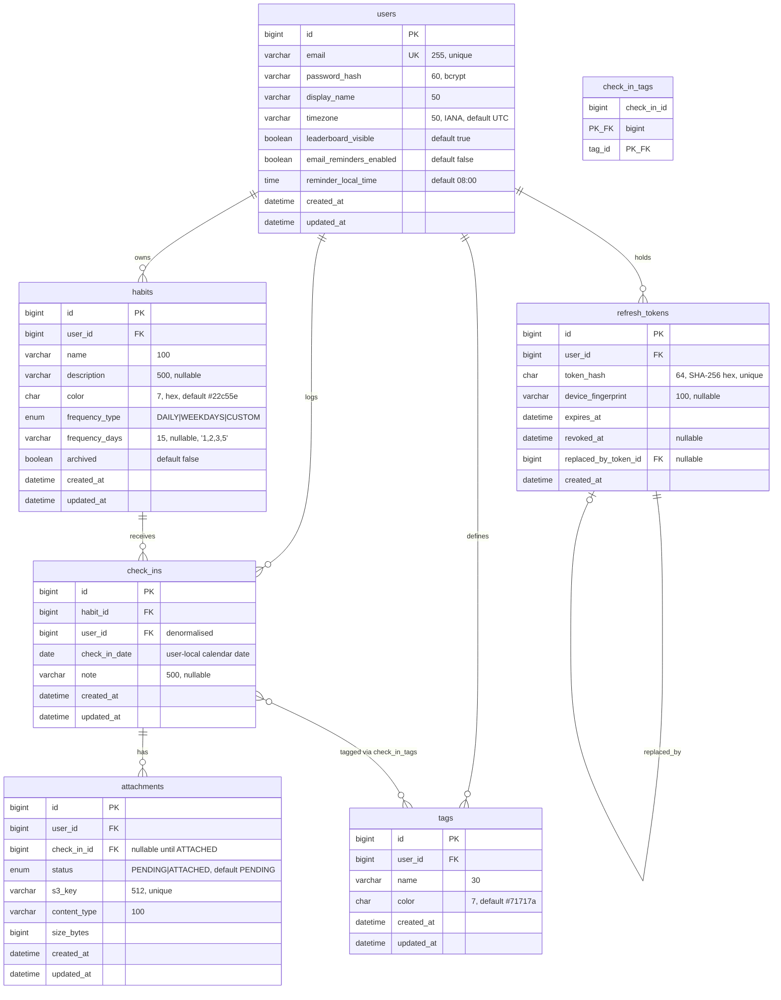

# StreakUp — Entity-Relationship Diagram

> **Database**: MySQL 8.0 (InnoDB, `utf8mb4_0900_ai_ci`)
> **Migration tool**: Flyway (versioned, forward-only)
> **Naming convention**: `snake_case` for tables/columns; all tables plural (`users`, `habits`).
> **Soft-deletion policy**: only `habits` are soft-deleted (via `archived`). Check-ins follow a hard-delete model because business rules depend on unique keys.
> **Timestamps**: mutable user-facing tables carry `created_at` and `updated_at` (UTC, `DATETIME(6)`). Join/session tables keep only the lifecycle timestamps they need.

---

## Visual Diagram (Mermaid)



---

## DBML Source (for dbdiagram.io)

> Paste the following into [dbdiagram.io](https://dbdiagram.io) to render a shareable PNG of the schema.

```dbml
// StreakUp — dbdiagram.io source
Project streakup {
  database_type: 'MySQL'
  Note: 'Habit tracking app, MVP schema. Generated from /docs/er-diagram.md.'
}

Table users {
  id                         bigint        [pk, increment]
  email                      varchar(255)  [not null, unique]
  password_hash              varchar(60)   [not null, note: 'BCrypt 60-char hash']
  display_name               varchar(50)   [not null]
  timezone                   varchar(50)   [not null, default: 'UTC', note: 'IANA TZ id']
  leaderboard_visible        boolean       [not null, default: true, note: 'Public leaderboard inclusion flag']
  email_reminders_enabled    boolean       [not null, default: false]
  reminder_local_time        time          [not null, default: '08:00:00']
  created_at                 datetime      [not null]
  updated_at                 datetime      [not null]

  Indexes {
    email [unique, name: 'uk_users_email']
  }
}

Table habits {
  id               bigint        [pk, increment]
  user_id          bigint        [not null, ref: > users.id]
  name             varchar(100)  [not null]
  description      varchar(500)
  color            char(7)       [not null, default: '#22c55e']
  frequency_type   varchar(16)   [not null, default: 'DAILY', note: 'DAILY | WEEKDAYS | CUSTOM']
  frequency_days   varchar(15)   [note: 'CSV of ISO weekdays 1..7, only when CUSTOM']
  archived         boolean       [not null, default: false]
  created_at       datetime      [not null]
  updated_at       datetime      [not null]

  Indexes {
    (user_id, archived) [name: 'idx_habits_user_active']
    (id, user_id)       [unique, name: 'uk_habits_id_user', note: 'target of composite FK from check_ins']
  }
}

Table check_ins {
  id              bigint        [pk, increment]
  habit_id        bigint        [not null]
  user_id         bigint        [not null, ref: > users.id, note: 'denormalised for list queries']
  check_in_date   date          [not null, note: 'calendar date in user timezone']
  note            varchar(500)
  created_at      datetime      [not null]
  updated_at      datetime      [not null]

  Indexes {
    (habit_id, check_in_date) [unique, name: 'uk_checkins_habit_date']
    (user_id, check_in_date)  [name: 'idx_checkins_user_date']
  }
}
Ref: check_ins.(habit_id, user_id) > habits.(id, user_id) // composite FK guarantees denormalised user_id matches owning habit

Table tags {
  id          bigint        [pk, increment]
  user_id     bigint        [not null, ref: > users.id]
  name        varchar(30)   [not null]
  color       char(7)       [not null, default: '#71717a']
  created_at  datetime      [not null]
  updated_at  datetime      [not null]

  Indexes {
    (user_id, name) [unique, name: 'uk_tags_user_name']
  }
}

Table check_in_tags {
  check_in_id bigint [not null, ref: > check_ins.id]
  tag_id      bigint [not null, ref: > tags.id]

  Indexes {
    (check_in_id, tag_id) [pk]
    tag_id                [name: 'idx_cit_tag']
  }
}

Table refresh_tokens {
  id                       bigint        [pk, increment]
  user_id                  bigint        [not null, ref: > users.id]
  token_hash               char(64)      [not null, unique, note: 'SHA-256 hex of opaque token']
  device_fingerprint       varchar(100)
  expires_at               datetime      [not null]
  revoked_at               datetime
  replaced_by_token_id     bigint        [ref: > refresh_tokens.id]
  created_at               datetime      [not null]

  Indexes {
    user_id     [name: 'idx_rt_user']
    expires_at  [name: 'idx_rt_expires']
  }
}

Table attachments {
  id            bigint        [pk, increment]
  user_id       bigint        [not null, ref: > users.id, note: 'owner of the pending or attached object']
  check_in_id   bigint        [ref: > check_ins.id, note: 'nullable until status=ATTACHED']
  status        varchar(16)   [not null, default: 'PENDING', note: 'PENDING | ATTACHED']
  s3_key        varchar(512)  [not null, unique]
  content_type  varchar(100)  [not null]
  size_bytes    bigint        [not null]
  created_at    datetime      [not null]
  updated_at    datetime      [not null]

  Indexes {
    user_id              [name: 'idx_att_user']
    check_in_id          [name: 'idx_att_checkin']
    (status, created_at) [name: 'idx_att_pending_sweep', note: 'AttachmentCleanupJob scans PENDING rows older than 1h']
  }
}
```

---

## Field-Level Design Notes

### `users`
| Field | Decision | Rationale |
|---|---|---|
| `password_hash` `CHAR(60)` | Fixed length | BCrypt outputs exactly 60 chars; over-allocating wastes a page slot. |
| `timezone` `VARCHAR(50)` | IANA identifier, not offset | Offsets don't handle DST. `Pacific/Auckland` is stable across daylight changes. |
| `leaderboard_visible` `BOOLEAN` | Public leaderboard gate | Lets users opt out of the public ranking without losing private totals or historical check-ins. |
| `reminder_local_time` `TIME` | Wall-clock time, not UTC | Reminder semantics are "8 am *my* time", not "20 UTC". The scheduler converts on each tick. These reminder fields are provisioned in schema early, but the user-facing API stays feature-flagged until `US-13` ships. |
| No `last_login_at` | Out of MVP | We don't have a feature that needs it; add later if analytics demand. |

### `habits`
| Field | Decision | Rationale |
|---|---|---|
| `archived` (soft delete) | Not hard delete | `US-05` requires preserving historical check-ins when a habit is deleted. |
| `frequency_type` ENUM + `frequency_days` CSV | Hybrid | Covers the 3 stated cases (`DAILY`, `WEEKDAYS`, `CUSTOM`) without introducing a `habit_schedule` join table. If we later add week-of-month rules, we'll normalise. |
| `color` `CHAR(7)` | `#rrggbb` format | Validated client-side; DB enforces length only. |
| Index `(user_id, archived)` | Covering index | Dashboard query is `WHERE user_id=? AND archived=false ORDER BY created_at`. Archived rows stay out of the hot scan. |
| `UNIQUE (id, user_id)` (`uk_habits_id_user`) | Required target of composite FK | `check_ins.(habit_id, user_id) → habits.(id, user_id)` needs this exact unique index. Without it, the denormalised `check_ins.user_id` is unenforceable. See ADR 0005. |

### `check_ins`
| Field | Decision | Rationale |
|---|---|---|
| `user_id` denormalised | Redundant with `habits.user_id` | Avoids a join for the very common "my check-ins" query, and lets us enforce ownership in a single `WHERE`. Sync is enforced by a **composite FK** `(habit_id, user_id) → habits(id, user_id)` backed by `uk_habits_id_user`: the DB rejects any row whose `user_id` doesn't match the owning habit, so drift is impossible without someone dropping the constraint. |
| `check_in_date` `DATE` | Not `DATETIME` | The business rule is "one check-in per *day*", where "day" is defined by the user's saved timezone. Store the calendar date the app computed; treat creation instant as audit-only (`created_at`). |
| `UNIQUE (habit_id, check_in_date)` | DB-level | Last line of defence against double-submit races; returns `409 Conflict` mapped from `DataIntegrityViolationException`. |
| Index `(user_id, check_in_date)` | Heatmap query | `SELECT check_in_date, COUNT(*) WHERE user_id=? AND date BETWEEN ? AND ? GROUP BY check_in_date` hits this index. |
| No `status` column | Intentional | The only "state" MVP needs is "done / not done" — existence of a row means done. No partial credit. |

### `tags`
- Scoped per-user (`uk_tags_user_name`). No global taxonomy. Keeps AI auto-tagging (Day 29) isolated per user.
- `updated_at` exists because tags are fully editable in MVP (`PATCH /tags/{id}`), not write-once.
- Tag deletion cascades into `check_in_tags` via FK.

### `refresh_tokens`
| Field | Decision | Rationale |
|---|---|---|
| `token_hash` only | Never store raw token | If the DB leaks, attacker cannot replay tokens. SHA-256 is sufficient (opaque random token has full entropy — no dictionary risk). |
| `replaced_by_token_id` | Lineage chain | Required for **theft detection**: if a token whose `revoked_at` is set *and* has a `replaced_by_token_id` is presented, that means the original leaked — revoke the whole chain. |
| `device_fingerprint` nullable | Optional | Hash of `User-Agent` + first two IP octets. Displayed in future "active sessions" UI. Not part of token validation (IPs rotate on mobile). |
| Cleanup index on `expires_at` | Nightly job | A ShedLock-guarded `@Scheduled` will purge tokens where `expires_at < NOW() - INTERVAL 30 DAY`. |

### `attachments`
- `user_id` persists ownership from the moment `/attachments/presign` mints the row. That lets `POST /check-ins` accept only `attachmentIds` owned by the authenticated caller even before a `check_in_id` exists.
- `status` is the two-phase upload marker: `PENDING` when `/attachments/presign` mints the URL; `ATTACHED` after a check-in references it and the API verifies the S3 object with `HEAD Object`. `check_in_id` is nullable while `PENDING` and is set in the same transaction as the check-in write that flips `status`.
- `updated_at` records the `PENDING -> ATTACHED` transition and makes operational debugging easier when cleanup jobs race with late confirms.
- `AttachmentCleanupJob` (ShedLock-guarded, hourly) deletes `PENDING` rows older than 1 hour along with their S3 objects. Index `(status, created_at)` makes that sweep O(pending), not O(table).
- `s3_key` is the only identifier; we never store the URL (URLs expire, keys don't).
- Uniqueness on `s3_key` prevents two DB rows claiming the same object.
- Cascade on check-in delete removes attachment rows; a separate job purges orphaned S3 objects (out of MVP, tracked in backlog).

---

## Relationship Summary

| From | To | Cardinality | On Delete | Note |
|---|---|---|---|---|
| `users` | `habits` | 1 — N | CASCADE | Deleting a user removes all their habits. |
| `users` | `check_ins` | 1 — N | CASCADE | Denormalised; must match `habits.user_id`. |
| `users` | `refresh_tokens` | 1 — N | CASCADE | Account deletion must revoke sessions. |
| `users` | `tags` | 1 — N | CASCADE | Tags are user-scoped. |
| `users` | `attachments` | 1 — N | CASCADE | Preserves ownership checks before a check-in is attached. |
| `habits` | `check_ins` | 1 — N | RESTRICT / NO ACTION | Habits are archived, not hard-deleted, in MVP. The composite FK exists for ownership integrity only; see ADR 0005. |
| `check_ins` | `attachments` | 1 — N | CASCADE | Attachments are meaningless without their check-in. |
| `check_ins` ↔ `tags` | M — N via `check_in_tags` | CASCADE both sides | — |
| `refresh_tokens` | `refresh_tokens` | self, optional | SET NULL | `replaced_by_token_id` survives parent removal so the chain can be inspected. |

---

## Migration Plan (Flyway file mapping)

| Migration | Scope | Phase |
|---|---|---|
| `V1__init_schema.sql` | `users` | Day 4 |
| `V2__add_habit_checkin.sql` | `habits`, `check_ins` | Day 8 |
| `V3__add_refresh_token.sql` | `refresh_tokens` | Day 11 |
| `V4__create_shedlock_table.sql` | `shedlock` (library-provided schema) | Day 15 |
| `V5__add_tags.sql` | `tags`, `check_in_tags` | Day 25 |
| `V6__add_attachments.sql` | `attachments` | Day 27 |

Each migration is forward-only. No `V*_undo_*.sql` files — rollback strategy is "forward-fix with a new migration", documented in `coding-standards.md`.

---

## Design Decisions Deferred to ADRs

- **Why SHA-256 hash for refresh tokens** (not bcrypt) → `/docs/decisions/0002-refresh-token-hashing.md`
- **Why soft-delete only habits** (not check-ins) → `/docs/decisions/0003-soft-delete-scope.md`
- **Why `DATE` for `check_in_date` + user timezone on server** → `/docs/decisions/0004-timezone-strategy.md`
- **Why denormalise `check_ins.user_id`** → `/docs/decisions/0005-checkin-user-denormalisation.md`

Stub ADR files now live under `/docs/decisions/` and can be expanded as implementation lands, but the decisions are already locked by this document.
